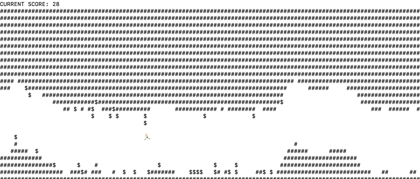

# brisk

A pet project game where the protagonist is in a rush. UI is your terminal; uses Dockered-up Python.

A little demo of what brisk looks like:

## Setup

All you need is `Docker` to run `brisk`, where the `Makefile` contains a command `make local_run` which both builds the `Docker` image and spins up a `Docker` container for you; bear in mind that `brisk` has been developed on `OS X`, so there might be some compatibility issues when it comes to the `Makefile` commands as well as `brisk`'s CLI usage. If you're trying to run `brisk` on Windows or on any Linux-based OS and something breaks, do let me know! If it works fine, do let me know too ;)